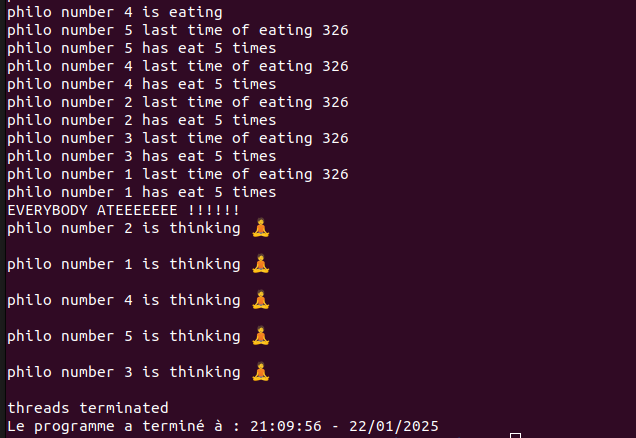

<div style="text-align: center;">
  
</div>

# Philosophers

**Philosophers** is a project from the 42 curriculum that focuses on solving the classic **Dining Philosophers Problem**. The challenge lies in implementing concurrent processes or threads while avoiding deadlocks, starvation, and race conditions.

---

## 📝 Project Description

The project simulates a group of philosophers sitting around a table, where:
- Each philosopher alternates between **thinking**, **eating**, and **sleeping**.
- There are as many forks as there are philosophers, and each philosopher needs **two forks** to eat.
- The program ensures that all philosophers follow these rules:
  - A philosopher can only eat if they can pick up both forks (one on their left and one on their right).
  - After eating, the philosopher puts down both forks and goes to sleep before starting to think again.
  - If a philosopher doesn’t eat within a certain time limit, they die.

The goal is to prevent deadlocks and ensure proper synchronization between threads or processes.

---

## 🚀 How to Use

### 1. **Clone the Repository**
```bash
git clone https://github.com/your-username/philosophers.git
cd philosophers
./philosophers number_of_philosophers time_to_die time_to_eat time_to_sleep (optionnal number of sequences)

